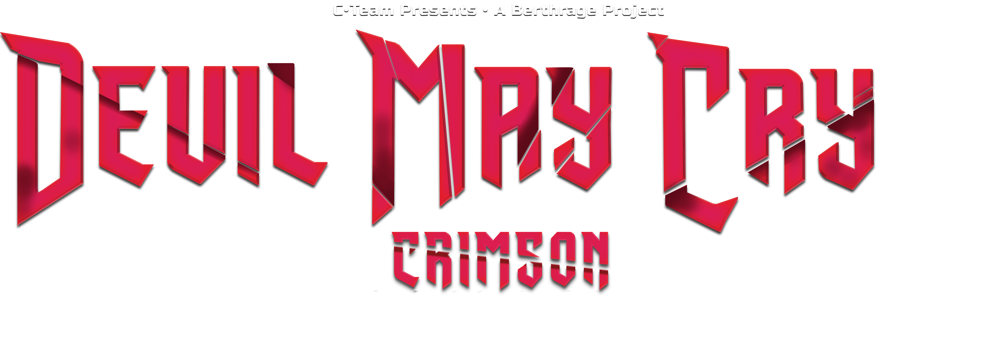

  

## PATCH NOTES BETA LAUNCH BUILD 0.3
Coming soon.

## WARNING  
BACKUP your save files! Crimson has extensive save syncing built-in and things should work just fine. But we will NOT be held responsible for loss of save game data.  

## CREDITS
# C•Team  
• Berthrage - Project Director, Lead Programmer, Artist, Reverse Engineering  
• Siyan - Reverse Engineering, Gameplay Programmer, Q&A, Testing  
• deepdarkkapustka - Reverse Engineering, Tooling, General Programmer  
• Darkness - Backend, Devops, General Programmer, Reverse Engineering  
• Charlie - Community Manager, Tester, Q&A  
• The Hitchhiker - General Programmer, Reverse Engineering 

## Contributions by
• Cynuma - Artist  
• Omar Nabelse - 3D Artist  
• Che - Mod Tooling  
• Vainiuss1 - Artist  

# DDMK
• serpentiem - Original DDMK's Developer  

# DMC3 Crimson is a free, open-source and non-commercial project
C•Team is an independent development group and is not affiliated with, endorsed by, or sponsored by CAPCOM Co., Ltd. All trademarks, including Devil May Cry, are the property of their respective owners. This project is a non-commercial initiative made out of passion and respect for the original work.  

Warning: Be careful about downloading supposed Crimson builds from unofficial sources, they could be fake and/or contain malicious code.

