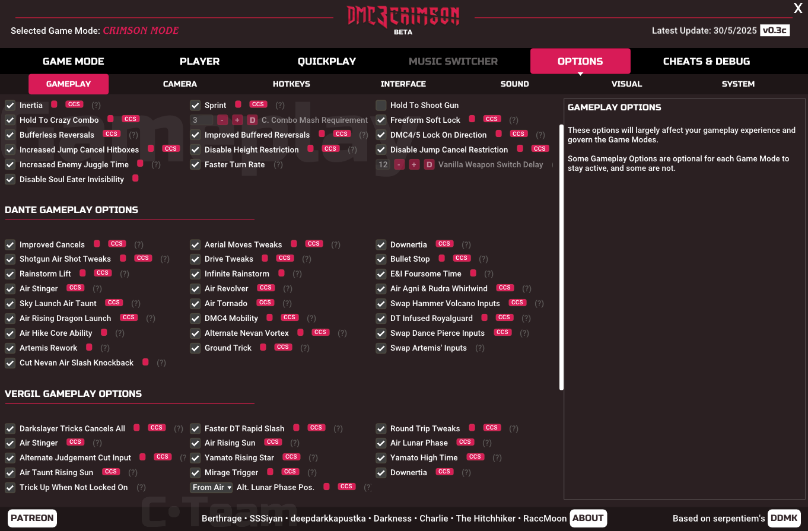
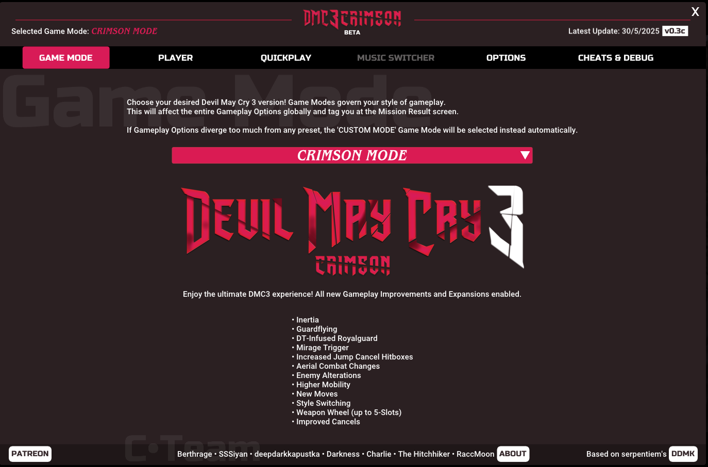
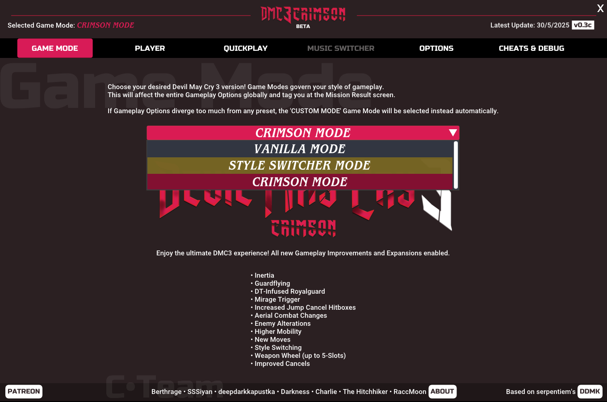
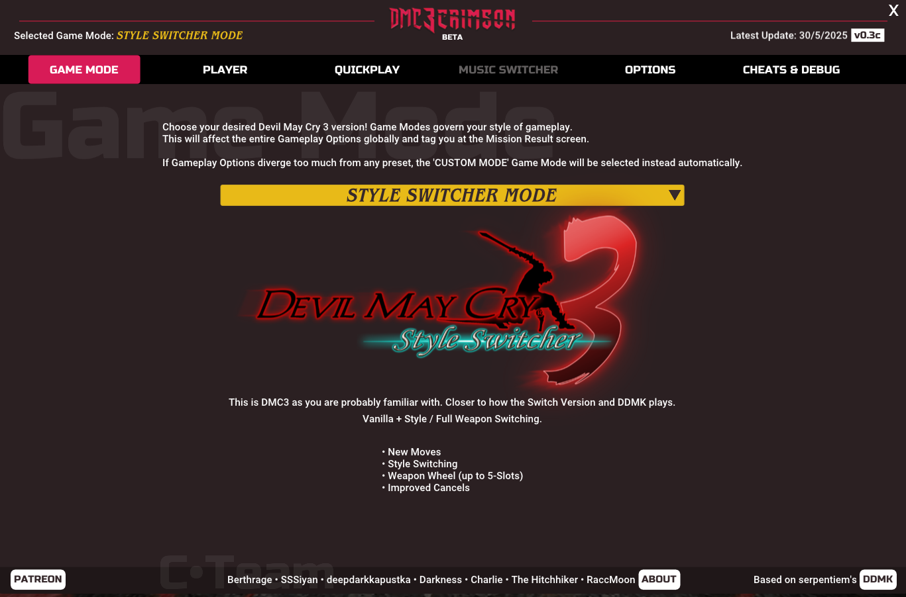
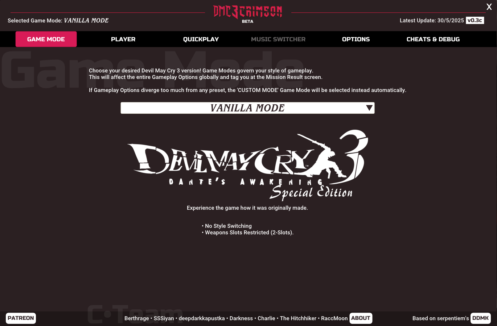

  
  
# THE ULTIMATE DMC3 EXPERIENCE   
DMC3 Crimson is an Overhaul Modification for Devil May Cry 3 (HD Collection version) that aims to bring Co-Op and PVP Multiplayer, High Frame-Rate support, Quality-of-Life improvements, Gameplay changes, Visual and Sound additions, Bugfixes, Cheats and more.

    
  

## FEATURE SET
• Style, Weapon and Character Switching  
• High Frame-Rate support (with reduced input lag for the HD Collection port)  
• Co-Op and PVP Multiplayer (with a Custom Multiplayer Camera)  
• Huge Gameplay changes including Inertia and Guardflying from DMC4  
• Quality of Life changes such as Hold to Crazy Combo, Bufferless Reversals   
• New Moves, especially from later entries in the series  
• An all new Third Person Camera   
• DMC3 Switch-styled Weapon Wheel with full functionality and support for Custom Weapon Loadouts  
• Visual additions with a new freshly made HUD and extra visual effects  
• New Sound Effects such as a Style Rank Announcer  
• A robust new UI menu for configuring all the options.  
• Configurable Cheats for Training and modifying the game to your heart's content   
• An up-to-date version of DMC3's [DDMK](https://github.com/serpentiem/ddmk) Trainer, including many Crashfixes and Bugfixes  

  
  
## MODULAR APPROACH
Though Crimson comes configured out of the box for a hassle-free experience, it includes Configurable Presets for you to tinker with and play Devil May Cry 3 the way you want to, called: Game Modes.  

     
     

## WARNING  
BACKUP your save files! Crimson has extensive save syncing built-in and things should work just fine. But we will NOT be held responsible for loss of save game data.  

# SUPPORT THE PROJECT
DMC3 Crimson is completely free and will always be. That said, you could greatly help the project's ongoing development by opting to support [Berthrage's Patreon](https://www.patreon.com/berthrage). A big thanks in advance to those who decide to do it.

## CREDITS
# C•Team  
• Berthrage - Project Director, Lead Programmer, Artist, Reverse Engineering  
• Siyan - Reverse Engineering, Gameplay Programmer, Q&A, Testing  
• deepdarkkapustka - Reverse Engineering, Tooling, General Programmer  
• Darkness - Backend, Devops, General Programmer, Reverse Engineering  
• Charlie - Community Manager, Tester, Q&A  
• The Hitchhiker - General Programmer, Reverse Engineering   
• RaccMoon - Tester, Q&A

## With additional work by 
• Dany Sterkhov - Video Producer, Consultant
• Che - Mod Tooling, Research  
• Cynuma - Artist  
• Omar Nabelse - 3D Artist  
• Vainiuss1 - Artist  
• Adil - Programmer  
• Airdragon - Programmer  
• Tihan - Audio Producer / Mixing  
• And Lenam was there too  

# DDMK
• serpentiem - Original DDMK's Developer  

# DMCHDFix
• Lyall

# DMC3 Crimson is a free, open-source and non-commercial project
C•Team is an independent development group and is not affiliated with, endorsed by, or sponsored by CAPCOM Co., Ltd. All trademarks, including Devil May Cry, are the property of their respective owners. This project is a non-commercial initiative made out of passion and respect for the original work.  

Warning: Be careful about downloading supposed Crimson builds from unofficial sources, they could be fake and/or contain malicious code.

## LICENSE
DMC3 Crimson is licensed under the [zlib license](https://github.com/berthrage/Devil-May-Cry-3-Crimson/blob/main/LICENSE) and includes [DMCHDFix by Lyall](https://github.com/Lyall/DMCHDFix) packaged in. The rest of the licenses should be contained [here](https://github.com/serpentiem/ddmk/tree/master/ThirdParty).

